# 👋 Привет! Меня зовут Юрий и я — Fullstack разработчик

Python (FastAPI), Node.js, Next.js, React, Redis, PostgreSQL  
📍 Санкт-Петербург / РФ  
📩 Telegram: @my_um9 | GitHub: github.com/mYNamEs7

---

Здесь собраны проекты, которые демонстрируют мой практический опыт
в создании реальных приложений — от backend- и frontend-архитектуры до интеграции с ИИ.

---

## 📂 Проекты

### 1️⃣ Freelance CRM

> Полнофункциональная CRM-система для управления фрилансерской деятельностью, построенная на современном асинхронном стеке Python.

🌐 [Demo](https://freelance-crm-one.vercel.app) · 📦 [GitHub](https://github.com/mYNamEs7/freelance-crm)

📸 Посмотреть скриншоты

 

  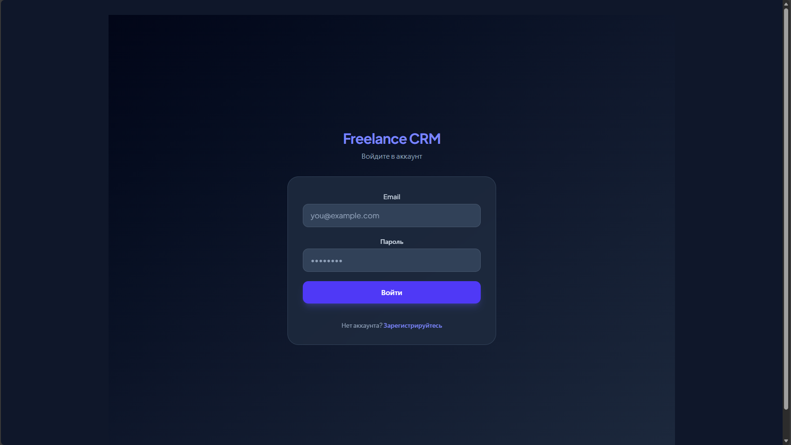
   
  <em>Начальный экран предлагает авторизоваться</em>

  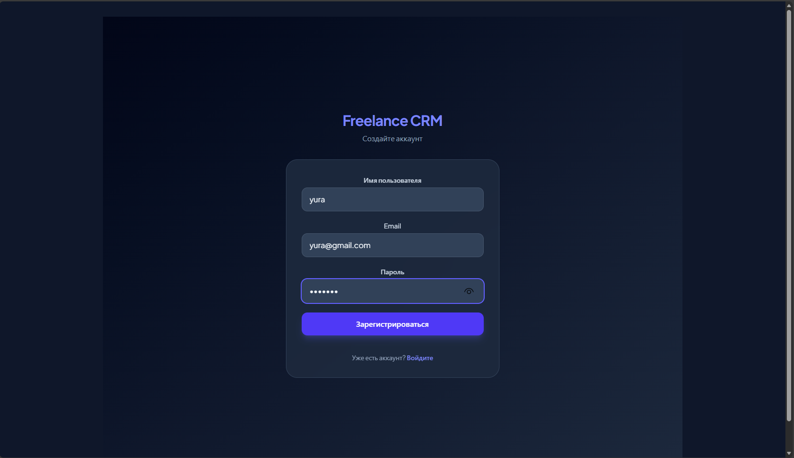
   
  <em>Если нету аккаунта, можно зарегистрироваться</em>

  
   
  <em>Информирование об успешной регистрации</em>

  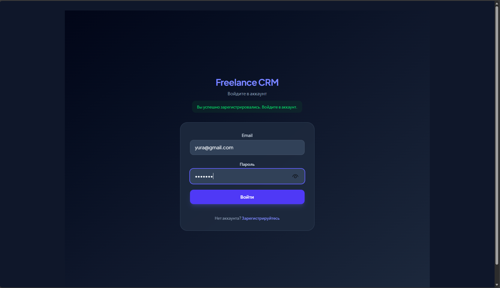
   
  <em>Теперь можно войти с зарегистрированным аккаунтом</em>

  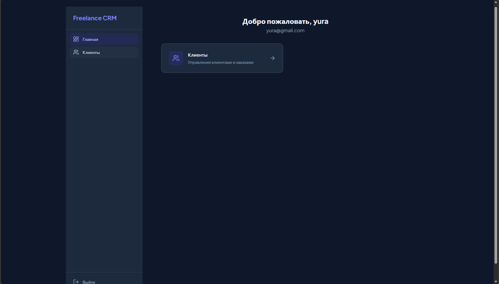
   
  <em>После успешной авторизации попадаем на главный экран</em>

  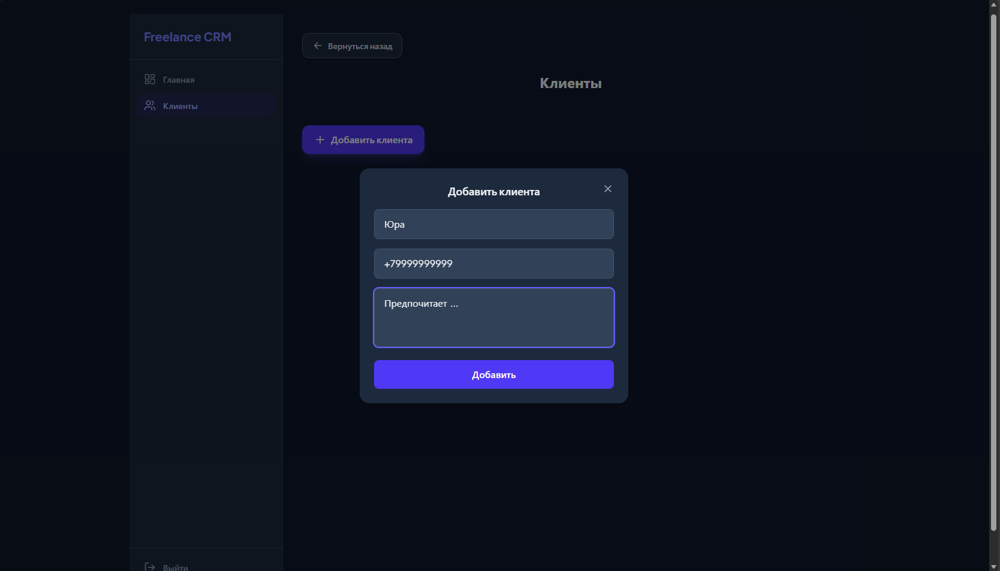
   
  <em>Здесь мы можем добавить новых клиентов (которые будут доступны только для текущего аккаунта)</em>

  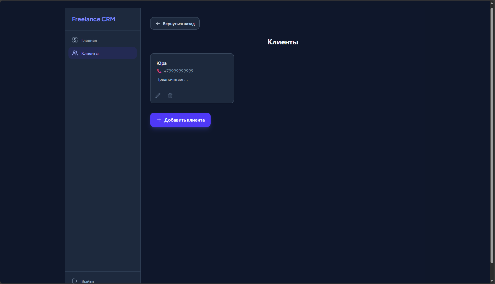
   
  <em>Добавили клиента</em>

  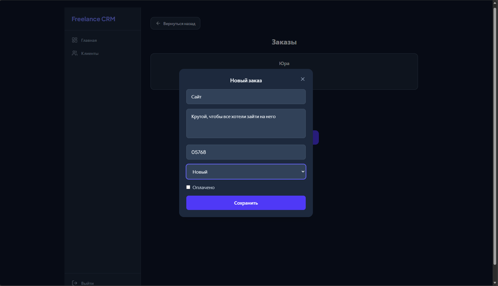
   
  <em>У каждого клиента есть свои заказы</em>

  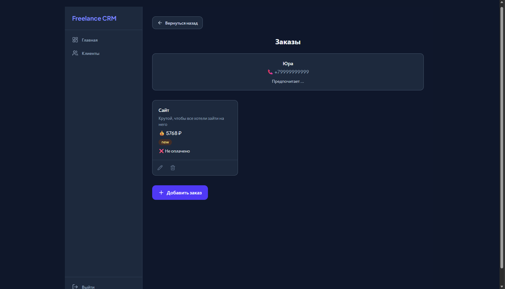
   
  <em>Добавили заказ</em>

  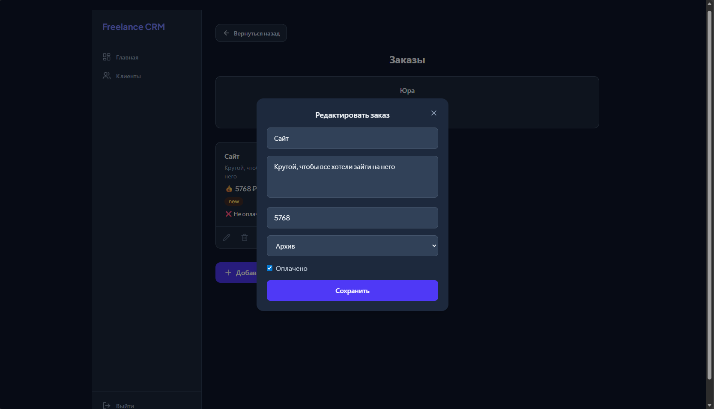
   
  <em>Заказ можно исправить</em>

  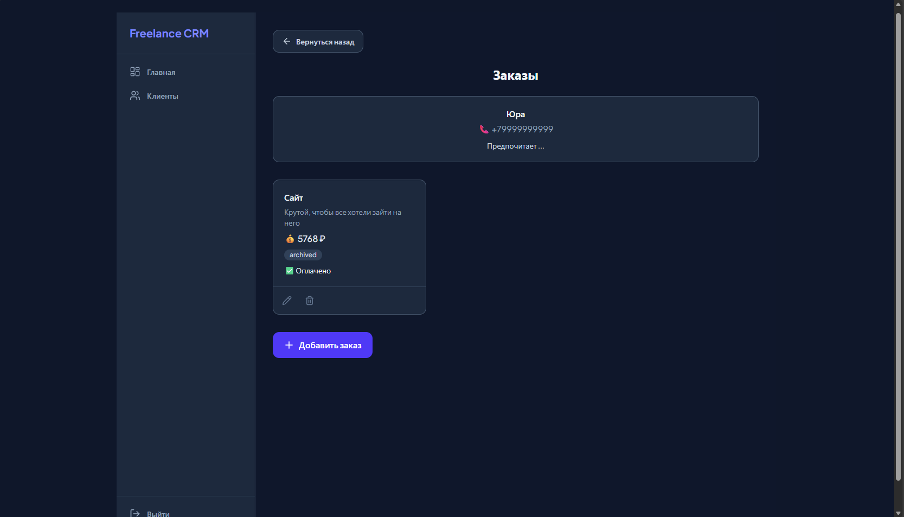
   
  <em>Исправленные заказы</em>

  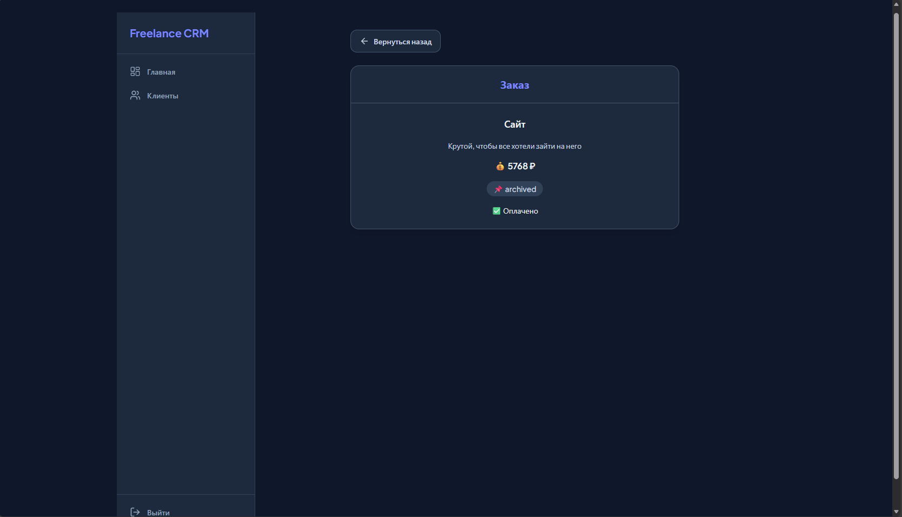
   
  <em>Каждый заказ можно посмотреть подробнее</em>

📖 Подробнее о проекте

 

<h3>🎯 О проекте</h3>

Freelance CRM решает ключевую проблему фрилансеров — хаос в управлении клиентами, проектами, задачами и финансами. Система объединяет всё в единый интерфейс с аналитикой и полным контролем рабочего процесса.

<b>Разработано с нуля</b> — от проектирования архитектуры и базы данных до развёртывания готового продукта.

<h3>🛠️ Технологический стек</h3>

<table>
  <tr>
    <th align="left">Направление</th>
    <th align="left">Технологии</th>
  </tr>
  <tr>
    <td><b>Frontend</b></td>
    <td>React · HTML5 · CSS3 · Tailwind · JavaScript</td>
  </tr>
  <tr>
    <td><b>Backend</b></td>
    <td>Python · FastAPI · SQLAlchemy (async) · Pydantic</td>
  </tr>
  <tr>
    <td><b>База данных</b></td>
    <td>PostgreSQL</td>
  </tr>
  <tr>
    <td><b>Безопасность</b></td>
    <td>JWT · bcrypt · httponly cookies</td>
  </tr>
  <tr>
    <td><b>Архитектура</b></td>
    <td>Модульная · REST-подобные маршруты · async/await</td>
  </tr>
</table>

<h3>⚙️ Ключевые возможности</h3>

<table>
  <tr>
    <th align="left">Возможность</th>
    <th align="left">Описание</th>
  </tr>
  <tr>
    <td>🔐 <b>Аутентификация</b></td>
    <td>Регистрация, авторизация через JWT, хэширование паролей, полная изоляция данных между пользователями</td>
  </tr>
  <tr>
    <td>👥 <b>Управление клиентами</b></td>
    <td>Полный CRUD с хранением контактов, компаний и заметок. Каждый клиент привязан к своим проектам</td>
  </tr>
  <tr>
    <td>📋 <b>Управление проектами</b></td>
    <td>Жизненный цикл проекта от создания до завершения: статусы, бюджеты, привязка к клиенту</td>
  </tr>
  <tr>
    <td>💰 <b>Финансовый учёт</b></td>
    <td>Отслеживание платежей по проектам, контроль оплаченных и ожидающих сумм</td>
  </tr>
  <tr>
    <td>⚡ <b>Redis-кэширование</b></td>
    <td>Снижение задержек и нагрузки на базу данных</td>
  </tr>
  <tr>
    <td>📱 <b>Адаптивный дизайн</b></td>
    <td>Оптимизация под мобильные и десктопные устройства</td>
  </tr>
</table>

<h3>💡 Что демонстрирует этот проект</h3>

<table>
  <tr>
    <th align="left">Область</th>
    <th align="left">Детали</th>
  </tr>
  <tr>
    <td>Проектирование архитектуры</td>
    <td>Чистая <b>модульная структура</b> с разделением ответственности</td>
  </tr>
  <tr>
    <td>Асинхронная разработка</td>
    <td><b>async/await</b> на всех уровнях приложения</td>
  </tr>
  <tr>
    <td>Работа с ORM</td>
    <td><b>Реляционные связи</b>, каскадные операции, фильтрация</td>
  </tr>
  <tr>
    <td>Безопасность</td>
    <td><b>JWT</b>, хэширование, защита маршрутов, изоляция данных</td>
  </tr>
  <tr>
    <td>Валидация данных</td>
    <td><b>Pydantic-схемы</b> на входе и выходе</td>
  </tr>
  <tr>
    <td>Полный CRUD</td>
    <td>Для каждой сущности реализованы <b>все операции</b></td>
  </tr>
  <tr>
    <td>Серверный рендеринг</td>
    <td><b>Jinja2-шаблоны</b> с переиспользуемыми компонентами</td>
  </tr>
</table>

---

### 2️⃣ Телеграм-бот на основе ИИ

🤖 [Попробовать в Telegram](https://t.me/eedu_ai_bot) · 📦 [GitHub](https://github.com/mYNamEs7/Edu-TG-AI)

> Образовательный Telegram-бот с интеграцией искусственного интеллекта, помогающий студентам в обучении — от генерации конспектов до проверки знаний.

📸 Посмотреть скриншоты

 

  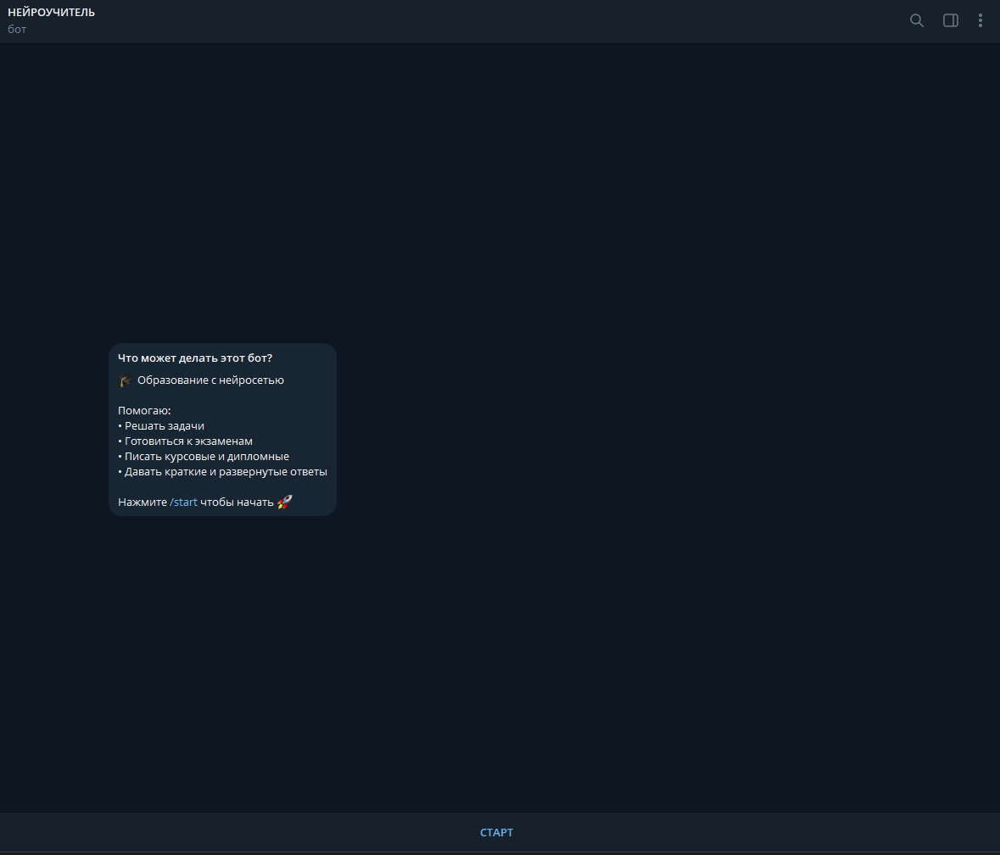
   
  <em>Начальный экран бота</em>

  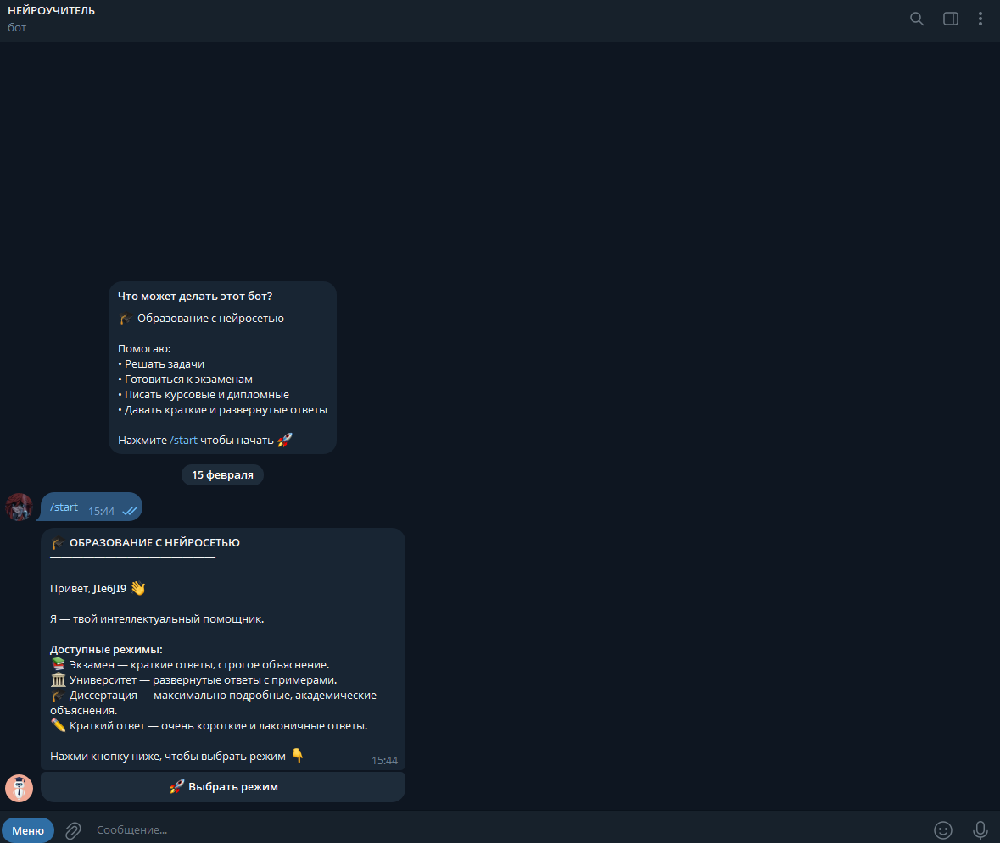
   
  <em>Приветствие</em>

  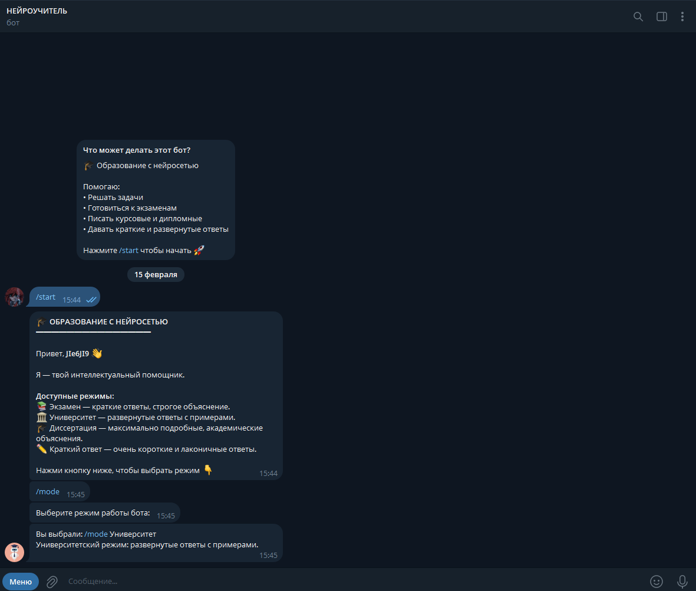
   
  <em>Выбор режима бота по кнопке</em>

  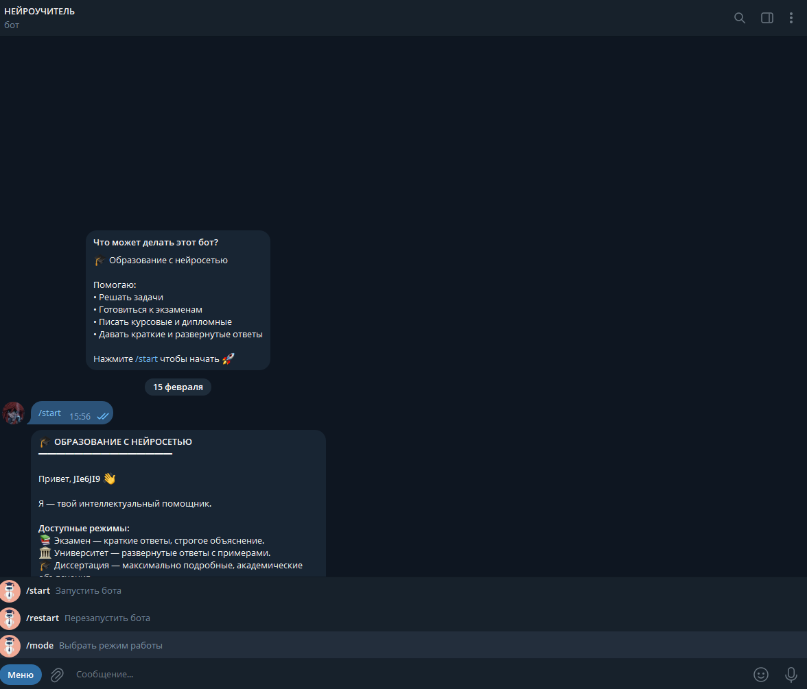
   
  <em>Команды бота</em>

  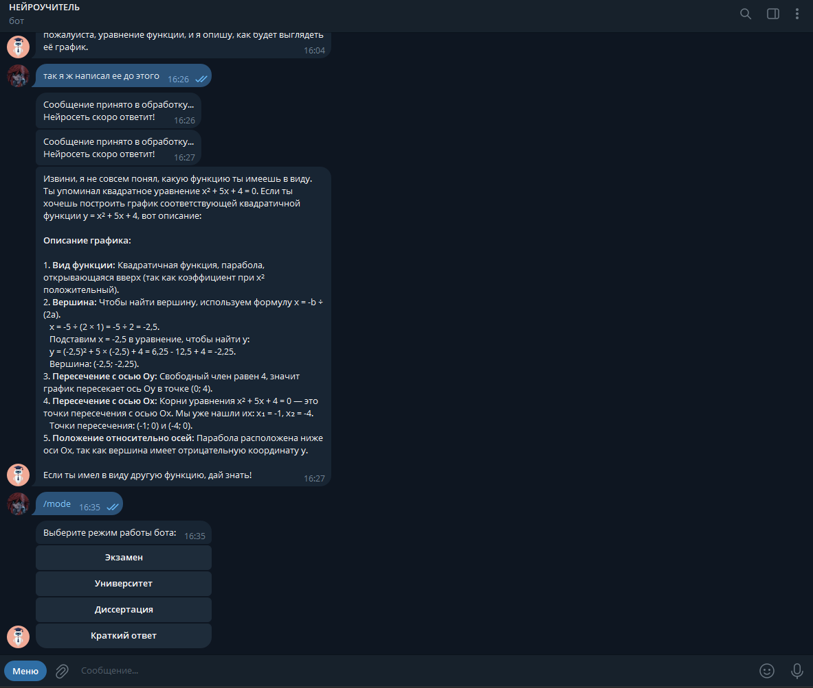
   
  <em>Изменить режим бота</em>

  <em>Общение с ботом с сохранением контекста</em>
   
  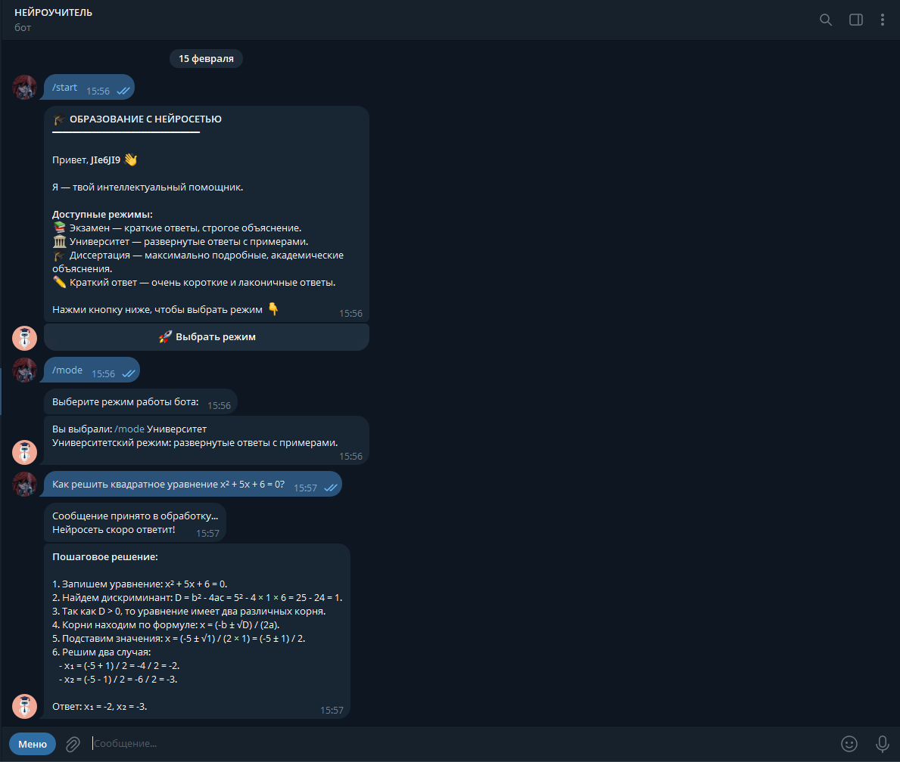
  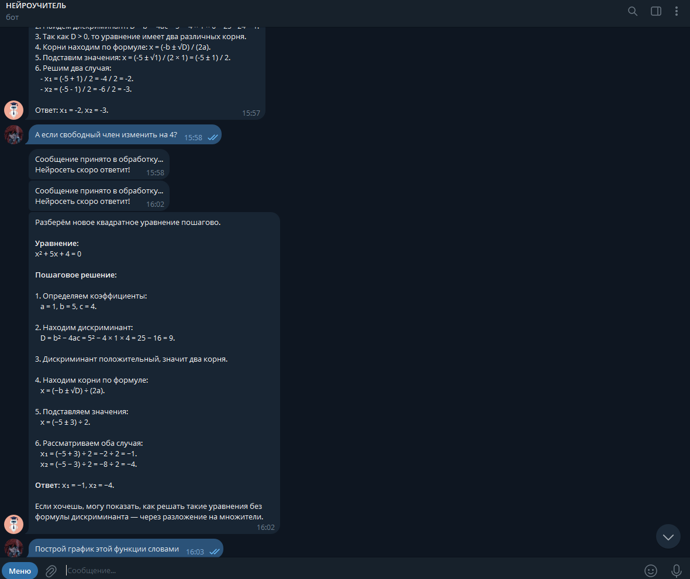
  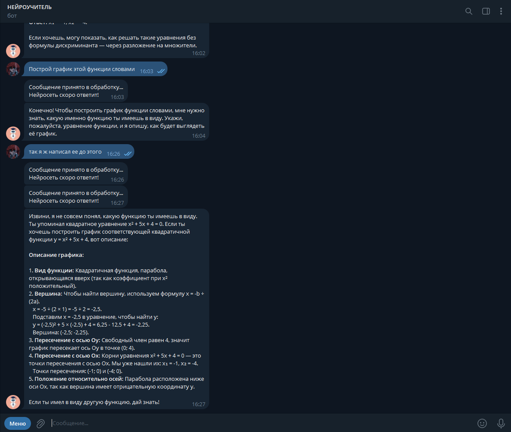

📖 Подробнее о проекте

 

<h3>🎯 О проекте</h3>

Edu TG AI — это интеллектуальный Telegram-бот, который превращает процесс обучения в интерактивный опыт. Бот использует AI для генерации учебных материалов, создания тестов, объяснения сложных тем и помощи с домашними заданиями.

<b>Разработано с нуля</b> — от продумывания пользовательских сценариев и интеграции с AI API до реализации полноценного бота с системой состояний и хранением данных.

<h3>🛠️ Технологический стек</h3>

<table>
  <tr>
    <th align="left">Направление</th>
    <th align="left">Технологии</th>
  </tr>
  <tr>
    <td><b>Язык</b></td>
    <td>Python</td>
  </tr>
  <tr>
    <td><b>Telegram API</b></td>
    <td>aiogram 3.x</td>
  </tr>
  <tr>
    <td><b>AI-интеграция</b></td>
    <td>OpenAI API / совместимые LLM</td>
  </tr>
  <tr>
    <td><b>Хранение данных</b></td>
    <td>PostgreSQL / SQLAlchemy</td>
  </tr>
  <tr>
    <td><b>Архитектура</b></td>
    <td>FSM (Finite State Machine), роутеры, middleware</td>
  </tr>
</table>

<h3>⚙️ Ключевые возможности</h3>

<table>
  <tr>
    <th align="left">Возможность</th>
    <th align="left">Описание</th>
  </tr>
  <tr>
    <td>💬 <b>Контекстный диалог</b></td>
    <td>Бот запоминает контекст беседы в рамках сессии, что позволяет вести последовательный диалог с уточняющими вопросами</td>
  </tr>
  <tr>
    <td>🧠 <b>AI-ассистент</b></td>
    <td>Диалог с искусственным интеллектом по любой учебной теме. Бот понимает контекст, отвечает на вопросы, объясняет сложные концепции простым языком</td>
  </tr>
  <tr>
    <td>👤 <b>Управление пользователями</b></td>
    <td>Регистрация пользователей, хранение истории взаимодействий, персонализация ответов</td>
  </tr>
  <tr>
    <td>🔄 <b>Webhooks</b></td>
    <td>Асинхронная обработка сообщений для масштабируемости</td>
  </tr>
</table>

<h3>💡 Что демонстрирует этот проект</h3>

<table>
  <tr>
    <th align="left">Область</th>
    <th align="left">Детали</th>
  </tr>
  <tr>
    <td>Интеграция с AI API</td>
    <td>Грамотная работа с LLM: <b>промпт-инжиниринг</b>, управление контекстом, обработка ответов</td>
  </tr>
  <tr>
    <td>Архитектура бота</td>
    <td><b>FSM-состояния</b>, роутеры, middleware, разделение ответственности</td>
  </tr>
  <tr>
    <td>Aiogram 3.x</td>
    <td>Современный асинхронный фреймворк, правильное использование <b>хэндлеров и фильтров</b></td>
  </tr>
  <tr>
    <td>Проектирование UX</td>
    <td>Продуманные сценарии взаимодействия, <b>inline/reply клавиатуры</b>, обработка ошибок</td>
  </tr>
  <tr>
    <td>Работа с БД</td>
    <td>Хранение пользователей, сессий, <b>истории запросов</b></td>
  </tr>
  <tr>
    <td>Промпт-инжиниринг</td>
    <td>Составление <b>системных и пользовательских промптов</b> для разных образовательных задач</td>
  </tr>
  <tr>
    <td>Обработка ошибок</td>
    <td><b>Graceful degradation</b> при недоступности AI, таймаутах, некорректных вводах</td>
  </tr>
</table>

## 🚀 Заключение

> Эти проекты отражают мою способность разрабатывать приложения с нуля,
> выстраивать backend-архитектуру и интегрировать сторонние API.
> Загляните в репозитории — буду рад обратной связи и сотрудничеству!

<h3>🚀 Открыт к новым возможностям и сотрудничеству</h3>

<i>Загляните в репозитории, чтобы изучить код и детали реализации.</i>

## 📬 Контакты
- Telegram: @my_um9
- Email: yura97078@gmail.com
